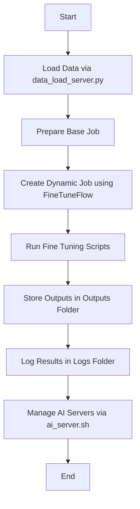

# ModelTrainingWorkspace

The `ModelTrainingWorkspace` is the core directory for managing and executing fine-tuning jobs. It integrates various components like data loading, job inheritance, and model training, forming the workspace for the **NoCodeTune** system.

## Folder Structure and Flow

```
ModelTrainingWorkspace/
├── archive/                 # Stores reusable components and utilities.
│   ├── data_load/           # Contains utilities for data loading.
│   │   └── data_load_server.py  # Server for managing and loading data.
│   │   └── file_operations_utils.py # File operations utilities.
│   ├── full_train/            # The base structure from which jobs inherit.
│   │   ├── files/           # Input files for base jobs.
│   │   ├── fine_tuning/     # Scripts for fine-tuning models.
│   │   ├── main.py          # Entry point for executing base jobs.
│   │   ├── outputs/         # Outputs generated by base jobs.
│   │   ├── server_utils.py  # Utilities for job-specific servers.
│   │   └── validate.py      # Validation scripts for job configurations.
│   ├
│   ├── ai_server.sh         # Script for managing AI servers.
│   └── check_requirements.py # Ensures required dependencies are installed.
├── files/                   # Shared files used across jobs.
├── jobs/                    # Contains all job configurations.
│   ├── demo_job/            # Example job for demonstration purposes.
│   └── FineTuneFlow Jobs/   # Dynamically generated jobs by FineTuneFlow.
├── logs/                    # Logs for monitoring and debugging.
```

## Workflow

### 1. **Data Loading**
- **Server**: The `data_load_server.py` manages the loading of datasets.
- **Utilities**: `file_operations_utils.py` provides utilities for handling file formats like CSV, JSON, and more.

### 2. **Full Train Configuration**
- **Inheritance**: `full_train` contains a reusable structure for creating new jobs.
  - **Files**: Input datasets or configurations.
  - **Fine Tuning**: Scripts to fine-tune models.
  - **Outputs**: Stores results of the fine-tuning.
  - **Validation**: Ensures job configurations are correct before execution.

### 3. **Job Execution**
- **Dynamic Jobs**: Jobs are created dynamically by **FineTuneFlow** and stored in the `jobs/` folder.
- **Demo Job**: The `demo_job` provides an example configuration to showcase the system's functionality.
- **Logs**: All execution details are captured in the `archive/logs/` folder for monitoring and debugging.

### 4. **AI Server Management**
- **Script**: The `ai_server.sh` script helps manage the lifecycle of AI servers for different jobs.

### Flow Chart



## Key Components
- **archive/**: Houses reusable utilities and base configurations.
- **jobs/**: Dynamically created job configurations and examples.
- **files/**: Shared resources across jobs.
- **ai_server.sh**: Manages server operations seamlessly.


## Contributors
Developed by: Murat Silahtaroğlu  
Contact: [muratsilahtaroglu13@gmail.com](mailto:muratsilahtaroglu13@gmail.com)